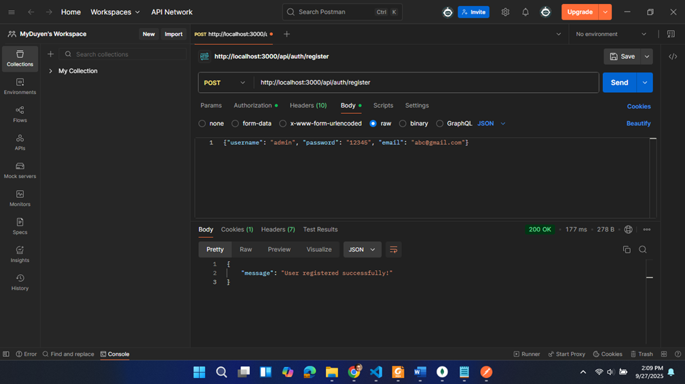
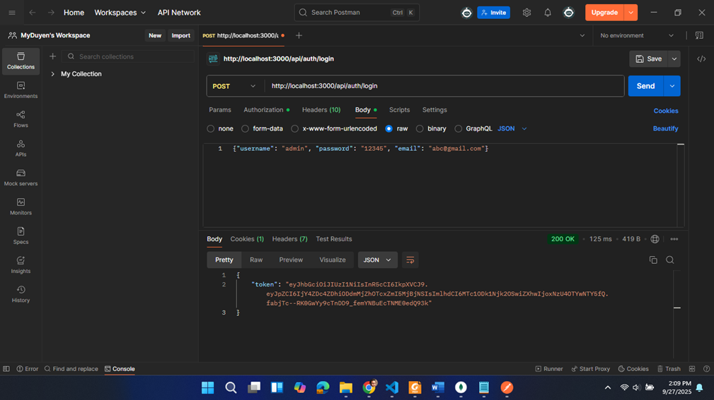
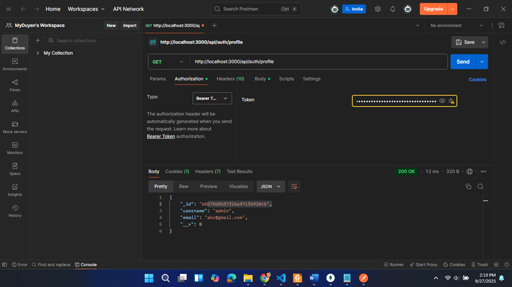
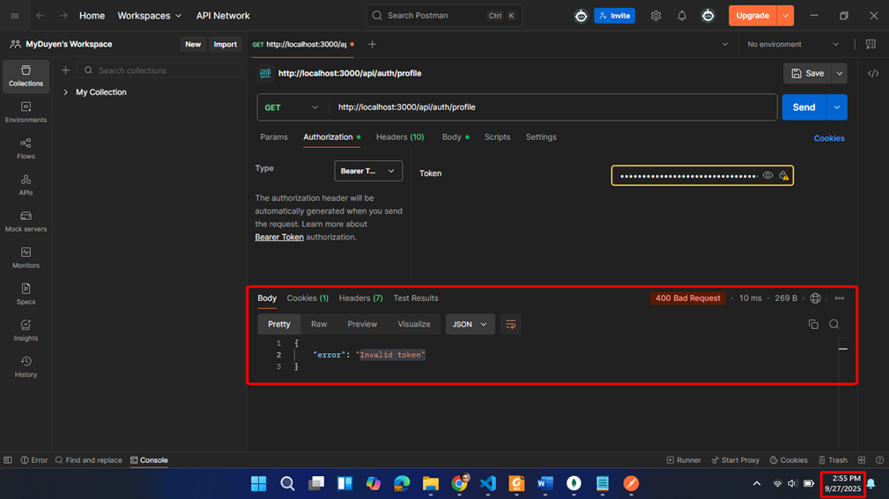

# Token Authentication Service

This is a Node.js application that implements authentication using tokens (JWT) to protect routes. Users can register, log in to receive a token, and this token will expire after a certain period.

## Setup

### 1. **Install Dependencies**
Run the following command to install all required dependencies:
```bash
npm install
```

### 2. **Run the Application**
Start the application with:
```bash
node app.js
```
The app will be accessible at `http://localhost:3000`.

---

## Postman Test Cases

### 1. **Register (POST /register)**
To register a new user, send a `POST` request to `/register` with the following body:

**Request:**
- **Method**: `POST`
- **URL**: `http://localhost:3000/api/auth/register`
- **Body (raw JSON)**:
  ```json
  {"username": "admin","password": "12345", "email": "abc@gmail.com"}
  ```

**Expected Response:**
- **Status Code**: 200 OK
- **Body**: Confirmation message indicating successful registration.
```json
{
  "message": "User registered successfully."
}
```

---

### 2. **Login (POST /login)**
To log in, send a `POST` request to `/login` with the following body:

**Request:**
- **Method**: `POST`
- **URL**: `http://localhost:3000/api/auth/login`
- **Body (raw JSON)**:
  ```json
  {"username": "admin","password": "12345", "email": "abc@gmail.com"}
  ```

**Expected Response:**
- **Status Code**: 200 OK
- **Body**: A token will be returned along with a success message.
```json
{
  "token": "<your_token_here>"
}
```

The token will expire after 30 seconds (or whatever the expiration time is set to in your code). You can test this expiry by checking the token after the expiration time.

---

### 3. **Access Protected Route (GET /profile)**

To access a protected route, send a `GET` request to `/profile` with the token in the **Authorization** header.

**Request:**
- **Method**: `GET`
- **URL**: `http://localhost:3000/api/auth/profile`
- **Headers**:
  - **Authorization**: `Bearer <your_token_here>` (replace `<your_token_here>` with the actual token)

**Expected Response (Within Token Expiry Time):**
- **Status Code**: 200 OK
- **Body**: The user's profile information.
```json
{
    "_id": "<id_account>",
    "username": "<your_username>",
    "email": "<your_email>",
    "__v": 0
}
```

---

### 4. **Test Token Expiry**

To test the token expiry, follow these steps:

1. **Login and Get Token**: First, log in and get the token using the `/login` route.
2. **Wait for Expiration**: The token will expire after the set time (e.g., 30 seconds).
3. **Access Protected Route After Expiry**: After waiting for the token to expire, try accessing the `/profile` route again.
4. **Expected Response (After Token Expiry)**:
   - **Status Code**: 400 Bad Request
   - **Body**: The response should indicate that the token is invalid or expired.

**Example Response**:
```json
{
  "error": "Invalid token"
}
```



---

## Conclusion

The `token_auth` project implements token-based authentication using JWTs. Use the above Postman test cases to test registration, login, profile access, and token expiration functionality.

If you have any issues or questions, feel free to check the routes and models defined in the project.
